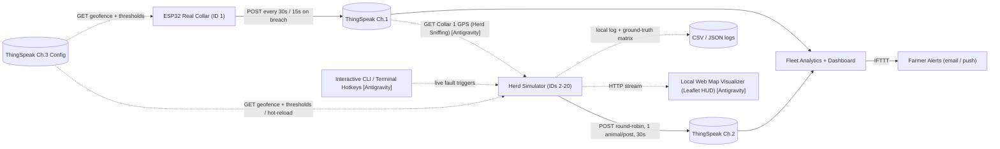
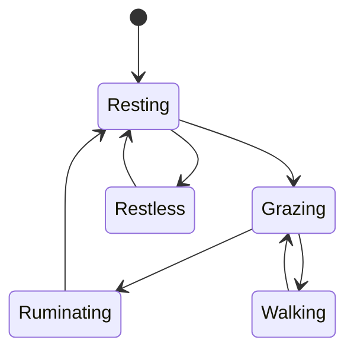

# Herd Digital-Twin Simulator — Project Requirement Document
**Wearable Computing — Cattle Fleet Management · Component Specification**
Course: Wearable Computing · Project Track: Cattle Fleet Management · Component: Herd Digital-Twin Simulator · Team: [add team member names]

Document status: Draft v2 (Updated with Antigravity Architectural Enhancements) · 2026-08-20

> **What this is.** A build-ready spec for the **herd simulator** referenced in the Proposal (Weeks 9–10: "herd simulator + proximity/roll-call logic"), the Review-1 research article ("digital-twin herd simulation coupled to a single physical prototype," Objective 4), and Review-2's HRS (Channel 2: "synthetic animals multiplexed onto one channel"). It doesn't restate those documents — read alongside them, especially Review-2's binding architecture section.
>
> **What was confirmed with you today (2026-08-20):** document format (Markdown) and reference herd size (**20 total: 1 real collar + 19 simulated**).
>
> **Architectural Enhancements (Antigravity Suggestions):** The specification has been augmented with 6 high-impact capabilities suggested by Antigravity:
> 1. **Live Collar-1 Sniffing & Synchronization** (anchoring simulated herd centroid to real ESP32 collar GPS via ThingSpeak Ch.1 GET with autonomous fallback).
> 2. **Interactive Live Fault Injection** (on-the-fly CLI commands alongside declarative JSON scenario scripts).
> 3. **Lightweight Zero-Dependency Local Visualizer HUD** (local Leaflet.js map + telemetry HUD via Python's built-in `http.server`).
> 4. **High-Speed Dry-Run & Offline Mode** (`--dry-run` to test/benchmark full 24h cycles in seconds without burning API quotas).
> 5. **Activity-Aware Battery Drainage Model** (dynamic discharge scaled by transmission cadence/breach bursts; *no solar recharge*).
> 6. **Ground-Truth Pairwise Distance & Anomaly Logging** (structured distance matrices to benchmark downstream proximity/clustering algorithms).

---

## 1. Purpose & Scope

**Why this component exists.** The project can only afford one physical collar (₹2,450, per Review-2's BOM), but the whole point of the fleet-analytics layer — proximity/social-network analysis, automatic roll call, herd movement analytics — only means something at herd scale. The Proposal's own framing is the spine of this document: validate fleet software with a digital twin before hardware scales. Done right, this costs **₹0 additional** over the single real collar; it's pure software sharing the same ThingSpeak account and the same downstream analytics code.

**In scope**
- Generating synthetic telemetry for 19 virtual animals, in the same shape and cadence as the real collar's Channel-1 telemetry.
- A round-robin scheme for multiplexing 19 animals onto Channel 2 within the ThingSpeak free-tier limits.
- A scenario/fault-injection interface (both declarative JSON scripts and interactive live CLI triggers) for fever, heat stress, geofence breach, tamper, isolation, and dropout events.
- **[Antigravity Suggestion]** True digital-twin synchronization: sniffing real Collar-1 GPS coordinates from Channel 1 to anchor the simulated herd's drift.
- **[Antigravity Suggestion]** Zero-dependency local live map visualizer (Leaflet.js + HUD) for live demo reviews.
- **[Antigravity Suggestion]** Fast dry-run execution mode (`--dry-run`) for rapid local testing without network latency or consuming write quotas.
- **[Antigravity Suggestion]** Activity-aware battery drainage modelling (burst-cadence vs. base-cadence drain; no solar recharge).
- **[Antigravity Suggestion]** Ground-truth distance matrix and anomaly logging for downstream fleet-analytics validation.
- Local logging, independent of ThingSpeak, for offline debugging and reproducibility.

**Out of scope** (see §12 for the full list) — most importantly: this document specifies the telemetry **generator**, not the fleet-analytics logic that consumes it (roll-call algorithm, proximity graph, alert rules). Those are downstream components covered elsewhere in the project. Solar recharging is explicitly out of scope for the battery model.

**At a glance**

| Parameter | Value | Status |
|---|---|---|
| Total herd size | 20 (1 real + 19 simulated) | Confirmed |
| Deliverable format | Markdown | Confirmed |
| Posting cadence | 30 s normal / 15 s on breach | Inherited from Review-2 (binding) |
| Round-robin full sweep | 570 s (~9.5 min) at 19 animals / 30 s | Calculated, see §10 |
| Combined annual message use (Ch.1+Ch.2, steady state) | ~2,102,400 / 3,000,000 | Calculated, see §10 |
| Additional hardware cost | ₹0 | Follows from Review-2's design |
| Implementation platform | Python script, laptop-run | Confirmed |
| Visualizer | Local web HUD (`http.server` + Leaflet.js) | **Antigravity Suggestion** |
| Collar-1 Sniffing | ThingSpeak Ch.1 Read (free GET) | **Antigravity Suggestion** |
| Battery Model | Dynamic activity drain (no solar recharge) | **Antigravity Suggestion** |

---

## 2. Related Documents

| Doc | Role for this component |
|---|---|
| `cattle-fleet-management-proposal.md` | Originates the herd-simulator concept (Weeks 9–10); system-layer framing (sensing → intelligence → fleet analytics → actuation → security → interface) |
| `cattle-collar-review1-research-article.md` | States the academic justification and Objective 4 (validate fleet-scale performance via digital twin); literature on digital twins [15] and dead-reckoning-style movement reconstruction [16] |
| `review2-lean-canvas-and-hrs.md` | **Binding architecture**: real NEO-6M GPS, ThingSpeak channel allocation, free-tier constraints, 8-field schema, cadence rules — this document builds directly on top of it and changes none of it |

---

## 3. Definitions & Abbreviations

| Term | Meaning |
|---|---|
| Digital twin / herd simulator | Software process generating synthetic per-animal telemetry standing in for animals without physical collars |
| Round-robin multiplexing | Cycling through N synthetic animals, one animal's data per ThingSpeak write |
| THI | Temperature-Humidity Index — heat-stress indicator computed from ambient temp + humidity |
| Composite risk score | Single per-animal number folding health, behaviour, and heat-stress signals (Review-2 HRS Function 1) |
| Geofence status | 0 = inside pasture, 1 = warning band, 2 = breach (proposed encoding, §8) |
| Scenario / fault injection | Deliberately scripting an anomaly (fever, breach, tamper, etc.) on a chosen animal at a chosen time, to test that the alerting logic actually catches it |
| Herd Sniffing | Periodic free GET requests on Channel 1 to synchronize simulated herd position with real collar GPS |
| Ground Truth Matrix | Per-tick logged matrix of true inter-animal distances and anomaly states for downstream benchmark validation |
| N_sim / N_total | Number of simulated animals (19) / total herd size (20) |

---

## 4. System Context

The simulator is a peer of the real collar, not a wrapper around it: both write into the same 8-field schema, so the analytics layer downstream cannot tell (and shouldn't need to tell) whether a given animal's data point came from silicon or from software.

---

## 5. Assumptions, Constraints & Dependencies

| ID | Statement | Basis |
|---|---|---|
| A1 | Deliverable format is Markdown | Confirmed |
| A2 | Reference herd size is 20 total (19 simulated) | Confirmed. All formulas below are written in terms of N_sim so the team can re-run them for a different size |
| A3 | Simulator runs as a standalone script on a laptop/PC with internet access during development and demos — **not** an always-on cloud service | Follows the Proposal's laptop-adjacent, zero-additional-cost pattern |
| A4 | Implementation language is Python 3 | Standard choice for scripting, local servers, and scientific simulation |
| A5 | Animal-ID space is unified 1–20 across the whole herd (ID 1 = real collar, IDs 2–20 = simulated), carried via the ThingSpeak `status` field on Channel-2 writes | Core protocol design (§8) |
| A6 | The composite risk-score formula and geofence polygon are owned by the real-collar firmware; the simulator must match them, not invent its own | Necessary for the digital twin to be a valid stand-in (see §9.5 on the cross-language nuance) |
| A7 | Ambient weather (for THI) is shared across the whole simulated herd — one pasture, one weather — not generated independently per animal | Physically realistic; keeps the model simple |
| A8 | ThingSpeak facts below (fields, status field, rate limits) were verified against MathWorks' ThingSpeak documentation and Licensing FAQ | Free tier: 4 channels, 15 s floor, 3M writes/year |
| A9 | Battery modeling excludes solar harvesting | Confirmed requirement; power is strictly consumed based on activity |

**Dependencies:** the real collar's ThingSpeak write/read API key(s), the agreed geofence polygon, and the final composite risk-score formula.

---

## 6. Functional Requirements

Priority follows MoSCoW (Must / Should / Could).

### 6.1 Herd Identity & Population

| ID | Requirement | Priority | Origin |
|---|---|---|---|
| FR-1 | Herd size N_sim shall be a configurable parameter, defaulting to 19 (N_total = 20 including the real collar) | Must | Core |
| FR-2 | Every animal shall have a stable unique ID across the whole herd: ID 1 = real collar, IDs 2–20 = simulated | Must | Core |
| FR-3 | Each simulated animal shall get a static per-run profile (baseline body temperature offset, individual behavioural tendency) generated at startup and held constant for the run, for reproducibility | Should | Core |

### 6.2 Behavioural State Simulation

| ID | Requirement | Priority | Origin |
|---|---|---|---|
| FR-4 | Each animal shall move through a 5-state behaviour model — resting, grazing, ruminating, walking, restless — matching Review-2's HRS Function 1 exactly | Must | Core |
| FR-5 | State transitions shall be time-of-day weighted (more grazing/walking near dawn/dusk, more resting/ruminating midday and at night) | Should | Core |
| FR-6 | Probability of the "restless" state shall increase for any animal with an active scripted or live-injected anomaly (fever, heat stress, isolation) | Must | Core |

### 6.3 Movement & Position

| ID | Requirement | Priority | Origin |
|---|---|---|---|
| FR-7 | A herd-centroid shall drift slowly within the shared pasture polygon (the same polygon used by the real collar's on-device geofence check) | Must | Core |
| FR-8 | Each animal's position shall be centroid + a bounded individual offset (herd cohesion), with offset magnitude and speed modulated by that animal's current behaviour state | Must | Core |
| FR-9 | Position generation shall support scripted/live excursions: a "straggler" offset (isolation testing) and a deliberate boundary crossing (breach testing) | Must | Core |
| FR-29 | **Collar-1 Sniffing & Synchronization:** The simulator shall periodically query ThingSpeak Channel 1 (`GET`). When valid GPS fixes exist for Collar 1, the herd centroid shall smoothly anchor to Collar 1's position; if Collar 1 is inactive/offline, the centroid shall seamlessly fall back to autonomous pasture drift | Should | **Antigravity Suggestion** |

### 6.4 Physiological & Environmental Telemetry

| ID | Requirement | Priority | Origin |
|---|---|---|---|
| FR-10 | Body temperature per animal = individual baseline + diurnal curve + noise, with a scriptable/injectable fever-onset ramp | Must | Core |
| FR-11 | Ambient temperature/humidity (shared across the herd) shall feed THI using the **identical formula** used on the real collar — not a separate reimplementation | Must | Core |
| FR-12 | Ambient source shall be configurable: a synthesized diurnal model (default) or a live free weather API for the farm's location | Should | Core |
| FR-30 | **Activity-Aware Battery Model:** Battery level (field8) shall deplete dynamically based on operating mode (accelerated drain during 15s breach bursts/active anomalies; standard baseline drain during resting/30s normal operation). Solar recharging is strictly disabled | Should | **Antigravity Suggestion** |

### 6.5 Reused Analytics (parity with the real collar)

| ID | Requirement | Priority | Origin |
|---|---|---|---|
| FR-13 | Composite risk score shall be computed using the **same algorithm, thresholds, and constants** as the real-collar firmware, verified by shared golden test vectors | Must | Core |
| FR-14 | Geofence status shall be computed with the identical Haversine + point-in-polygon logic as the real collar, against the same polygon | Must | Core |

### 6.6 Scenario Scripting & Live Fault Injection

| ID | Requirement | Priority | Origin |
|---|---|---|---|
| FR-15 | A declarative scenario file (JSON or YAML) shall specify timed events per animal: `fever_onset`, `heat_stress`, `geofence_breach`, `tamper`, `social_isolation`, `collar_dropout` | Must | Core |
| FR-16 | At least one canned "demo" scenario shall ship with the simulator, ready for a live class walkthrough | Should | Core |
| FR-17 | A random seed shall control all stochastic generation, so a scenario run is exactly reproducible | Must | Core |
| FR-31 | **Interactive Live Fault Injection:** The simulator shall support on-the-fly anomaly injection via an interactive CLI / terminal prompt (e.g. `fever <id>`, `breach <id>`, `tamper <id>`, `clear <id>`) during live execution without restarting the simulation | Must | **Antigravity Suggestion** |

### 6.7 ThingSpeak Multiplexed Uplink

| ID | Requirement | Priority | Origin |
|---|---|---|---|
| FR-18 | A round-robin scheduler shall post exactly one synthetic animal's data per Channel-2 write, cycling through all N_sim animals in order | Must | Core |
| FR-19 | Each Channel-2 write shall carry the animal's ID and event code in the `status` field (e.g. `id=07` or `id=07;evt=FEVER`) | Must | Core |
| FR-20 | An animal with an active scripted/injected event shall get a priority slot — jumping the rotation — so the event surfaces immediately on the next write cycle | Should | Core |
| FR-21 | Default cadence is 30 s/write, with a 15 s floor that is never violated | Must | Core |
| FR-22 | A time-compression mode may advance the simulated `created_at` timestamp faster than wall-clock time while respecting the physical 15 s HTTP floor | Could | Core |

### 6.8 Fleet-Analytics Support & Ground Truth

| ID | Requirement | Priority | Origin |
|---|---|---|---|
| FR-23 | Every configured animal ID shall appear at least once per full round-robin sweep (~9.5 min) | Must | Core |
| FR-24 | Position data shall be realistic enough to support downstream pairwise-distance / social-network computation | Should | Core |
| FR-32 | **Ground-Truth Matrix Logging:** The simulator shall export a structured ground-truth log recording true pairwise physical distances (meters) and exact health/tamper states at every internal tick, enabling downstream teams to benchmark proximity clustering algorithms | Should | **Antigravity Suggestion** |

### 6.9 Local Logging & Execution Modes

| ID | Requirement | Priority | Origin |
|---|---|---|---|
| FR-25 | Every generated and posted value shall be appended to a local CSV/JSON log | Must | Core |
| FR-26 | The log shall be replayable to regenerate an identical run offline | Should | Core |
| FR-33 | **Dry-Run & High-Speed Offline Mode:** A `--dry-run` CLI flag shall execute the complete multi-hour simulation cycle in fast-forward (bypassing HTTP POSTs) and generate full CSV/JSON logs in seconds for rapid debugging and test-vector generation | Must | **Antigravity Suggestion** |

### 6.10 Local Live Map Visualizer & Config Hot-Reload

| ID | Requirement | Priority | Origin |
|---|---|---|---|
| FR-27 | The simulator shall read the geofence polygon and thresholds from Channel 3 at startup (and periodically thereafter) | Should | Core |
| FR-28 | Fallback to a local config file if Channel 3 is unreachable | Could | Core |
| FR-34 | **Local Visualizer HUD:** The simulator shall host a lightweight, zero-external-dependency local web dashboard (served via Python's built-in `http.server`) rendering a real-time Leaflet.js map with pasture polygons, color-coded animal pins (Green=normal, Yellow=warning, Red=breach/fever), and transmission queue HUD | Should | **Antigravity Suggestion** |
| FR-35 | **Config Hot-Reloading:** The simulator shall detect live modifications to local `config.yaml` or Channel 3 and hot-reload geofence boundaries and alert thresholds without interrupting animal states or resetting the simulation loop | Could | **Antigravity Suggestion** |

---

## 7. Non-Functional Requirements

| ID | Category | Requirement |
|---|---|---|
| NFR-1 | Cost | Zero additional hardware or paid-service cost; runs entirely against the existing free-tier ThingSpeak account |
| NFR-2 | Performance | The internal simulation tick (state/position/physiology update) runs independently of, and faster than, the ThingSpeak posting cadence — simulation fidelity is never coupled to the 15 s floor |
| NFR-3 | Reliability | Failed POSTs are retried with backoff; a failure for one animal must not block or desync the rest of the round-robin queue |
| NFR-4 | Portability | Runs on a standard laptop (Windows/macOS/Linux) needing only Python 3 and basic standard/lightweight libraries |
| NFR-5 | Maintainability | Risk-scoring and geofence logic track the real-collar firmware via a single documented spec and shared test vectors — never drift into two silently-different implementations |
| NFR-6 | Usability | Start/stop/scenario-select is a single command or a simple config edit — demo-able live, no rehearsal script required |
| NFR-7 | Observability | Console/log output and local Web HUD are narratable during a live class demo |
| NFR-8 | Compliance | Never exceeds the verified free-tier limits: 4 channels, 15 s/write floor, 3,000,000 writes/year (§10) |

---

## 8. Data & Interface Specification

### 8.1 ThingSpeak field mapping (shared by Channel 1 and Channel 2)

| Field | Meaning | Type | Range / Units | Real-collar source | Simulator source |
|---|---|---|---|---|---|
| field1 | Body temperature | float | °C | MLX90614 | baseline + diurnal + noise (+ fever injection) |
| field2 | THI (heat-stress index) | float | index value | DHT11 + formula | shared weather model + **same** formula |
| field3 | Behaviour state | int, 0–4 | 0 resting … 4 restless | MPU6050 classifier | state-machine model (§6.2) (`0=resting, 1=grazing, 2=ruminating, 3=walking, 4=restless`) |
| field4 | Latitude | float | decimal degrees | NEO-6M GPS | movement model (§6.3) or synchronized from Collar 1 |
| field5 | Longitude | float | decimal degrees | NEO-6M GPS | movement model (§6.3) or synchronized from Collar 1 |
| field6 | Composite risk score | numeric | scale TBD — owned by firmware | on-device scoring fn | **same** scoring fn (§6.5) |
| field7 | Geofence status | int, 0–2 | 0 inside, 1 warning band, 2 breach | Haversine + point-in-polygon | same logic on synthetic fix |
| field8 | Battery | numeric | % | ADC GPIO34 | **[Antigravity Suggestion]** Activity-aware decay curve (faster on 15s bursts; no solar recharge) |
| `status` (reserved field) | Animal ID + event code | text, ≤255 bytes | e.g. `id=07` or `id=07;evt=FEVER` | not needed (Channel 1 = fixed ID 1) | **required on every Channel-2 write** |

Event codes: `FEVER, HEAT, BREACH, TAMPER, ISOL, DROPOUT`.

---

## 9. Simulation & Behavioural Model Design

### 9.1 Behaviour state machine

### 9.2 Movement & Herd Sniffing Model
- **Autonomous Mode:** Herd centroid performs a slow bounded random walk inside the pasture polygon. Each simulated animal stays within a bounded distance of the centroid, modulated by behaviour state.
- **[Antigravity Suggestion] Herd Sniffing Mode (FR-29):** The simulator queries ThingSpeak Channel 1 for Collar 1's live GPS coordinates. When fresh data is received, the simulated herd centroid smoothly locks onto Collar 1's coordinates, causing the 19 virtual cows to flock around the real physical device in real time.

### 9.3 Physiological & Activity-Aware Battery Model
- Body temperature follows individual baseline + diurnal curve + noise + scripted/interactive fever ramps.
- THI uses the exact formula: $THI = (1.8 \times T + 32) - (0.55 - 0.0055 \times RH) \times (1.8 \times T - 26)$.
- **[Antigravity Suggestion] Battery Model (FR-30):** Base discharge rate corresponds to resting/grazing states at 30s cadence. When an animal enters breach/warning states (15s cadence + active alerts), discharge rate triples. Solar recharging is omitted.

### 9.4 Round-robin scheduler & Priority Jump
Base rule: 1 write per 30s cycling through IDs 2–20 in order. When an anomaly is triggered (via JSON scenario or interactive CLI), that animal immediately jumps to the front of the queue for the very next HTTP write.

### 9.5 Cross-Language Parity & Golden Vectors
Document the risk-score and geofence formulas once, and maintain a shared `golden_test_vectors.json` (fixed inputs → expected outputs) that both the C++ firmware and Python simulator must pass.

### 9.6 [Antigravity Suggestion] Local Web Visualizer HUD (FR-34)
A self-contained Python module uses the built-in `http.server` to serve an HTML5/Leaflet.js dashboard on `http://localhost:8000`. The map renders the pasture polygon, positions of all 20 animals with real-time color coding (green/yellow/red), and a table showing the live transmission queue.

---

## 10. Message Budget & Timing Analysis

All figures verified against MathWorks' ThingSpeak free-tier limits: 4 channels, 15 s minimum write interval, 3,000,000 writes/year.

**Round-robin sweep time** (time for every simulated animal to get one fresh data point = N_sim × cadence):
- At 30 s cadence (19 animals): **570 s (~9.5 minutes)**
- At 15 s breach burst (19 animals): **285 s (~4.75 minutes)**

**Annual/daily message budget (Channels 1 + 2 combined at 30 s steady state):**
- Messages/day: **5,760**
- Messages/year: **~2,102,400** (well within the 3,000,000 free-tier ceiling, leaving ~30% headroom for breach bursts).
- Dry-run mode (`--dry-run`) consumes **0 messages**, preserving budget for final demos.

---

## 11. Acceptance Criteria

| ID | Criterion | Origin |
|---|---|---|
| AC-1 | Over a continuous 24-hour run, ≥99% of round-robin sweeps include all 19 configured animal IDs at least once | Core |
| AC-2 | Each of the 6 scenario event types can be triggered on demand (scripted or CLI) and appears in Channel 2 within one priority slot | Core |
| AC-3 | Annual message volume for Channels 1+2 combined stays under 3,000,000 | Core |
| AC-4 | A shared golden-test-vector suite produces matching outputs from the real-collar firmware and the simulator | Core |
| AC-5 | The local log can replay a run and reproduce an identical telemetry feed offline | Core |
| AC-6 | Time-compression demo mode presents a full simulated day within a bounded classroom window (≤20 min) without violating the 15s floor | Core |
| AC-7 | **[Antigravity Suggestion]** Live fault injection via CLI triggers immediate telemetry shift and priority queue jump without stopping the process | Antigravity |
| AC-8 | **[Antigravity Suggestion]** Local web map HUD renders all 20 cows, pasture boundaries, and status colors in real time via zero external web server dependencies | Antigravity |
| AC-9 | **[Antigravity Suggestion]** Dry-run mode runs a full 24-hour simulation cycle in <10 seconds and produces valid CSV logs | Antigravity |

---

## 12. Risks & Open Questions

| ID | Risk / question | Notes |
|---|---|---|
| R1 | Behaviour-transition weights are illustrative defaults | Calibrate against Review-1 dataset once available |
| R2 | `status`-field ID/event-tag scheme test | Test on a live free-tier channel before Week 9 |
| R3 | ~9.5-minute per-animal refresh at N_sim=19 | Coarse for fast motion, but matches real cattle collar power-saving cadences |
| R4 | Real vs. synthetic weather source | Synthesized diurnal model is default; live API is stretch goal |

---

## 13. Traceability

| Requirement group | Traces to |
|---|---|
| Herd identity, behaviour, movement (§6.1–6.3) | Proposal, System layers 1–3; Review-1, Scope; Review-2 HRS |
| Collar-1 Sniffing & Sync (§6.3, FR-29) | **Antigravity Suggestion** (True digital twin coupling) |
| Reused risk score & geofence logic (§6.5) | Review-2 HRS, Functions 1 & 2; Proposal, System layer 2 |
| Scenario scripting & Live CLI injection (§6.6, FR-31) | Review-1 Abstract & Objective 4; **Antigravity Suggestion** |
| ThingSpeak multiplexed uplink (§6.7) | Review-2 Architecture (Channel 2) & Free-tier constraints |
| Ground-Truth Matrix & Dry-Run (§6.8–6.9, FR-32, FR-33)| **Antigravity Suggestion** (Validation for downstream analytics) |
| Local Web HUD Visualizer (§6.10, FR-34) | **Antigravity Suggestion** (Live review presentation HUD) |

---

## 14. Next Steps

1. Build core utility math (Haversine, Point-in-Polygon, THI formula, golden test vectors).
2. Implement Animal model, behaviour state machine, and activity-aware battery drainage (no solar recharge).
3. Implement Round-Robin scheduler with Priority Queue and local CSV/JSON + Ground-Truth logger.
4. Implement Dry-Run mode and Live CLI fault injector.
5. Implement Local Web Visualizer HUD (`http.server` + Leaflet.js).
6. Implement ThingSpeak Channel-2 client & Channel-1 Sniffer.
