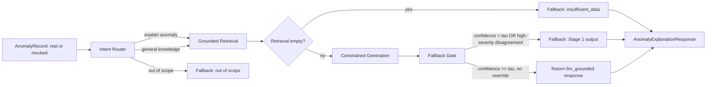

# PRD — Cattle Collar Behavioral-Anomaly Detection & Explanation Assistant

**Status:** Ready for implementation. Nothing has been built yet — this is a greenfield build, organized as two parallel tracks.
**Owner:** MTZ
**Target implementer:** an AI coding agent (Antigravity, Claude Code, or Codex — tool not yet chosen; this document is written to be tool-agnostic)

> **Note to the implementing agent:** Read this entire document before writing code. Section 6 (the `AnomalyRecord` contract) is the single most important artifact here — it is what lets Stage 1 and Stage 2 be built at the same time by the same person or different people without either blocking the other. Freeze it before writing pipeline code in either stage. Section 4 (Non-Goals) is binding: do not build outside it without flagging the deviation to the human operator. Every item tagged **[OPEN QUESTION]** needs a decision from MTZ — stop and surface it rather than guessing silently.

---

## 0. How this project is organized — two parallel tracks

This system is built as **two tracks that run at the same time**, not a sequential pipeline:

- **Stage 1 — Anomaly Detection.** Pure classical ML and statistics, no LLM anywhere. Consumes the `db-cow-walking` dataset (behavior classification) and the `MmCows` dataset (personal-baseline deviation detection). Produces a structured `AnomalyRecord` for every cow-window: is this different from her own normal, and what specifically changed.
- **Stage 2 — RAG Application.** The LLM layer: retrieval, grounded generation, the calibrated fallback gate, and Ragas-based evaluation. Consumes `AnomalyRecord`s (real, once Stage 1 produces them — mocked before that) and turns them into a cited, farmer-readable explanation.

The two tracks share exactly one thing: the `AnomalyRecord` / `AnomalyExplanationResponse` schemas in Section 6. Freeze those first, build a mock generator for them, and both tracks proceed independently from there. Section 14 spells out exactly what's parallel and the one place it isn't.

## 1. Summary

Build a system that detects when a dairy cow's behavior or physiology has meaningfully shifted from her own established normal — not from a fixed population threshold, and not a disease diagnosis — and explains that shift in grounded, cited natural language for a farmer or vet. Stage 1 does the detection: a behavior classifier trained on IMU data (walking/grazing/resting) and a per-cow SPC/CUSUM baseline over temperature and lying behavior, both evaluated with real, mechanically-derivable ground truth. Stage 2 does the explaining: an LLM that is hard-constrained to answer only from a small grounded knowledge base, falls back to the deterministic Stage 1 output whenever it can't ground itself, and is evaluated with Ragas. The specific contribution — the thing that makes this different from adjacent published work (Section 3) — is that the explanation is driven by a live wearable's continuous sensor stream, not a typed symptom query, which nothing in the reviewed literature does.

## 2. Background (self-contained)

The parent project is a sub-$20 (₹2,450 Indian BOM) ESP32-based cattle collar — MLX90614 IR thermometer, DHT11, MPU6050 IMU, GPS — reporting to a ThingSpeak/IFTTT dashboard (`review2-lean-canvas-and-hrs.md`, `cattle-collar-review1-research-article.md`). Nothing described in this PRD has been implemented yet; this is a from-scratch build.

Two datasets, two roles, no overlap:

- **`db-cow-walking`** (Morales-Vargas et al. 2025, `github.com/WASP-lab/db-cow-walking`) — 441 labeled IMU events (walking/grazing/resting/miscellaneous) from 10 cows. Trains and evaluates the behavior classifier, targeting the published SVM baseline (96.29% accuracy / 0.9625 macro-F1) under leave-one-cow-out cross-validation, per `behavior-classification-beat-baseline-plan.md`.
- **`MmCows`** (Vu et al. 2024, `github.com/neis-lab/mmcows`) — 14 continuous days per cow, persistent ID. This project uses exactly three of its wearable-sensor streams, plus one optional: `cbt` (core body temperature, 1-min), `ankle` (leg-orientation / lying-vs-standing state, 1-min — **not** raw acceleration, see the Section 9 correction note), `thi` (ambient temperature-humidity index, 1-min), and optionally `immu` (neck accelerometer + magnetometer, 100ms, for finer activity-magnitude detail on top of the lying/standing state). Milk yield is explicitly excluded — not enough data to validate it as a signal. Visual/camera data is a separate, much larger download and is not used at all.

Neither dataset has illness ground truth. That's not a gap to work around — it's why this system detects *anomalies relative to a cow's own baseline*, not diseases. See Section 3 for what that means for how this compares to the closest published work.

## 3. Prior art & what this system actually claims

Three published systems do "LLM + knowledge graph + fallback" for livestock diagnosis, and any write-up needs to disclose all three:

- **GraphRAG-Vet** (Qu et al., *Computers* 15(4):203, 2026) — fine-tuned Qwen-2-7B + a 2,500-entity veterinary knowledge graph, hard-constraint fallback (`"Data Not Available"` on empty retrieval), evaluated on 500 vet-annotated queries at Cohen's κ=0.92: 100% accuracy on core diseases, 88% on boundary/overlapping-symptom cases.[^1]
- **"When Pigs Get Sick"** (arXiv:2503.15204) — multi-agent swine diagnosis, confidence-threshold escalation to expert review, GPT-4o at 90.63% accuracy on an 812-question expert-curated test set.[^2]
- **MultiGraph-vet** (PubMed 42407432) — a third, dairy-specific system; full text was not accessible during research. **[OPEN QUESTION for MTZ]**: verify directly if you want full confidence in the disclosure below.

**All three are text-in, text-out** — a person types or speaks a symptom description, the system retrieves and answers. None of them take continuous wearable-sensor data as input. This system's claim is not "we diagnose better than they do" — it structurally can't be, since none of these three have illness ground truth to diagnose against either, and this project deliberately isn't trying to. The claim is: **this is the first system in the reviewed literature that explains a *detected* anomaly from a live sensor stream**, rather than answering a question someone typed. That's a different task, not a numeric rematch — cite these three as adjacent methodology (the fallback pattern, the evaluation discipline) while being explicit that the comparison stops there.

## 4. Goals

- G1. Stage 1 detects, per cow-window, whether behavior and/or physiology has shifted from that animal's own baseline, and which specific signal(s) drove the shift.
- G2. Stage 2 produces grounded, cited explanations of what Stage 1 detected, hard-constrained to retrieved facts — never an ungrounded guess.
- G3. Stage 2 maintains a calibrated confidence gate that defers to Stage 1's raw deterministic output whenever the LLM shouldn't be trusted (Section 10) — not an eyeballed cutoff.
- G4. Show that the LLM's explanation adds real value over showing the farmer the raw SPC/CUSUM chart alone — measured via a classical-only ablation (Section 11), the same instinct the old disease-diagnosis version applied against GraphRAG-Vet, now applied against your own Stage 1 output.
- G5. Achieve this using **only mechanically-derivable or deliberately-injected ground truth** — no external dataset license, no hand-constructed disease scenarios, no dependency on vet review to produce a usable golden set (vet review remains valuable for the KB's literature framing, but is never a blocker for evaluation, unlike the disease-diagnosis version of this plan).
- G6. Run without a GPU or self-hosted model for Stage 2 — a prompted hosted LLM API call only.
- G7. **Stage 2 must be fully buildable and testable against a mocked `AnomalyRecord` before Stage 1 produces real output.** This is a hard design requirement, not a nice-to-have — see Section 6 and Section 14.

## 5. Non-goals

- Do **not** feed raw IMU samples or raw temperature time series to the LLM at any point in Stage 2. Stage 1 always sits between the sensors and the LLM.
- Do **not** fine-tune a model for the MVP. Prompted, hosted API call only.
- Do **not** build a full agentic tool-calling loop for Stage 2. The pipeline is fixed and linear (Section 7).
- Do **not** attempt to match GraphRAG-Vet's knowledge-graph scale. The Stage 2 KB is a few dozen literature-derived facts about behavior-shift patterns, not a 2,500-entity disease ontology.
- Do **not** use CowScreeningDB, milk yield, or MmCows' visual data. All three were considered and dropped — CowScreeningDB because it only supports a disease-diagnosis claim this project no longer makes, milk yield for insufficient data to validate as a signal, visual data for compute/storage cost with no role in this design.
- Do **not** block Stage 2 development on Stage 1 being finished. The mock generator (Section 6) is the explicitly sanctioned path, not a fallback for when things run late.
- Do **not** run any of this on the ESP32. Both stages run server/cloud-side.
- LangGraph or any orchestration framework is optional tooling for Stage 2, not a requirement.

## 6. The shared contract — freeze this before writing pipeline code in either stage

This is what makes the two stages genuinely parallel. Implement as validated models (e.g., Python `pydantic`) in a location **both stages import from** (Section 13) — never duplicated.

### 6.1 `AnomalyRecord` (Stage 1's output; Stage 2's primary input)

```json
{
  "cow_id": "string",
  "timestamp": "ISO8601",
  "window_id": "string",
  "behavior_state": "walking | grazing | resting | miscellaneous",
  "behavior_state_confidence": "float [0,1]",
  "behavior_state_distribution_24h": {"walking": "float", "grazing": "float", "resting": "float", "miscellaneous": "float"},
  "cbt_c": "float — core body temperature, °C",
  "cbt_deviation_sigma": "float — deviation from this cow's own baseline, in std-devs",
  "cbt_cusum_value": "float",
  "lying_time_pct_24h": "float — from the MmCows ankle/orientation signal",
  "lying_time_deviation_sigma": "float — deviation from this cow's own baseline",
  "thi": "float — ambient temperature-humidity index, context only, not itself a deviation signal",
  "activity_magnitude_deviation_sigma": "float | null — from immu, optional signal",
  "herd_isolation_score": "float [0,1] | null — optional, if the fleet-analytics proximity graph exists",
  "anomaly_flag": "bool — Stage 1's own deterministic decision",
  "anomaly_score": "float [0,1]",
  "driving_signals": ["cbt", "lying_time", "activity_magnitude", "behavior_state"],
  "recent_anomaly_history": [{"timestamp": "ISO8601", "flag": "bool", "driving_signals": ["string"]}]
}
```

`driving_signals` is what Stage 2's explanation is actually built around — it's the mechanical answer to "what changed," independent of any LLM call.

### 6.2 Mock generator (Stage 2's unblock mechanism — build this in week 1, regardless of who's building what)

A small script that produces `AnomalyRecord`s with realistic distributions: mostly `anomaly_flag: false` with small random deviations, a minority with `anomaly_flag: true` and one or two populated `driving_signals`, occasional nulls for the optional fields. It does not need to be statistically sophisticated — its only job is to give Stage 2 something schema-valid to develop against from day one. Swap it for Stage 1's real output once available (Section 14); nothing else in Stage 2 should need to change when that swap happens, which is the actual test of whether the contract was designed correctly.

### 6.3 `AnomalyExplanationQuery` (optional free text alongside an `AnomalyRecord`)

```json
{
  "query_id": "string",
  "cow_id": "string",
  "raw_text": "string | null",
  "submitted_by": "farmer | vet | system_auto",
  "timestamp": "ISO8601"
}
```

### 6.4 `AnomalyExplanationResponse` (Stage 2's output)

```json
{
  "query_id": "string",
  "cow_id": "string",
  "path_taken": "llm_grounded | fallback_stage1_output | fallback_insufficient_data",
  "anomaly_summary": "string | null — what changed, in plain language",
  "confidence": "float [0,1] | null",
  "rationale": "string",
  "cited_facts": [{"fact_id": "string", "source": "string", "text": "string"}],
  "contributing_signals": ["cbt", "lying_time"],
  "suggested_next_step": "string — e.g. 'monitor', 'visual check', 'flag for a vet visit if this persists'",
  "stage1_output": {"anomaly_flag": "bool", "anomaly_score": "float", "driving_signals": ["string"]},
  "disagreement_flag": "bool — true if the LLM's summary and Stage 1's own flag materially disagree",
  "latency_ms": "int",
  "model_version": "string",
  "timestamp": "ISO8601"
}
```

Note there is no `suspected_condition` field, and `suggested_next_step` is deliberately generic (monitor / check / escalate) rather than disease-specific treatment — that's the anomaly-explanation framing carried into the schema itself, not just the prose around it.

### 6.5 `GoldenCase` (eval set, JSONL)

```json
{
  "case_id": "string",
  "category": "core | injected | adversarial",
  "source": "mmcows_real | db_cow_walking_real | synthetic_injection | synthetic_adversarial",
  "injection_type": "string | null — e.g. 'grazing_drop_30pct_3day', null for real unperturbed cases",
  "input_record": "<AnomalyRecord>",
  "query_text": "string | null",
  "gold_anomaly_flag": "bool",
  "gold_driving_signals": ["string"],
  "gold_key_facts": ["string", "..."],
  "reviewed_by": "string, or 'mechanical' for cases derived directly from real or injected data"
}
```

Gone from the old schema: `gold_condition` and `requires_disambiguation` — there's no disease label anymore, and the fever/heat-stress/mastitis overlap this used to flag doesn't apply to anomaly detection. `injection_type` replaces it as the thing that makes a case useful for evaluation, since you control exactly what was injected and can check whether the system caught and correctly attributed it.

## 7. Stage 2 architecture



Five fixed stages, unchanged in shape from the earlier version of this PRD — only the content each stage reasons about has changed:

1. **Record Assembler** — validates an `AnomalyRecord` (real or mocked) and optional `AnomalyExplanationQuery`. No LLM call.
2. **Intent Router** — classifies free text as `explain_anomaly | general_knowledge | out_of_scope`. No free text (system-triggered auto-explanation of a Stage-1 flag) always routes to `explain_anomaly`.
3. **Grounded Retrieval** — queries the KB (Section 9) using `driving_signals` and any query entities. Returns a possibly-empty fact set.
4. **Constrained Generation** — produces an `AnomalyExplanationResponse` using only retrieved facts and the `AnomalyRecord`'s own numbers. Empty retrieval skips straight to `fallback_insufficient_data`.
5. **Fallback Gate** — applies the calibrated threshold and safety-override logic (Section 10).

## 8. Functional requirements per component

**Record Assembler**
- FR-1: Reject a malformed `AnomalyRecord`; never proceed on partial data.
- FR-2: Accept records from either the mock generator or Stage 1's real output through the identical interface — this is the concrete test of Section 6's contract being correctly designed.

**Intent Router**
- FR-3: Single cheap call, separate from Stage 4's main generation call.
- FR-4: `out_of_scope` never reaches retrieval or generation.

**Grounded Retrieval**
- FR-5: Query the KB using `driving_signals` from the `AnomalyRecord` plus any free-text entities.
- FR-6: Return a source identifier with every fact (needed for `cited_facts` and Ragas Layer 2).
- FR-7: Retrieval is deterministic and logged independently of what the LLM does with it.

**Constrained Generation**
- FR-8: Prompt explicitly instructs the model to answer only from provided facts and the record's own numbers.
- FR-9: Output must be schema-valid `AnomalyExplanationResponse`; one retry on malformed output, then `fallback_insufficient_data`.
- FR-10: **For every anomaly with more than one populated `driving_signals` entry, the prompt must explicitly reason across all of them together** (e.g., a `cbt` deviation alongside an elevated `thi` reads differently than the same `cbt` deviation with normal `thi`) — this multi-signal reasoning, grounded in real fused sensor data, is the actual differentiation claim from Section 3, and it's a functional requirement here, not a narrative one.

**Fallback Gate**
- FR-11: τ is a calibrated, configured value (Section 10), never hardcoded.
- FR-12: A high-severity disagreement between the LLM's `anomaly_summary` and Stage 1's own `anomaly_flag`/`anomaly_score` always routes to `fallback_stage1_output`, regardless of stated confidence — hard safety rule.
- FR-13: Every response includes `stage1_output` — the farmer/vet always sees the deterministic number, whichever path was taken.

## 9. Knowledge base specification

**Correction carried over from discussion:** MmCows' `ankle` signal is leg *orientation* for lying/standing detection, sampled at 1 minute — not raw acceleration. If you want raw movement magnitude in addition to the lying/standing state, that's `immu` (neck accelerometer + magnetometer, 100ms), used optionally. Don't conflate the two when writing ingestion code.

Scope: literature-grounded facts about what **behavior-shift patterns** are associated with, not a disease ontology. Target categories, seeded from papers already cited across this project's docs (the Frondelius/Barker/Walker/Solano line in `cattle-collar-review1-research-article.md`'s own introduction, plus the Lamanna review already cited elsewhere):

- Sustained grazing-time reduction
- Sustained lying/resting-time increase
- Activity-magnitude reduction (if `immu` is in use)
- Herd-isolation increase (if the proximity graph exists)
- Temperature deviation *with* elevated THI (environmental explanation available) vs. *without* (points toward the animal specifically) — this is FR-10's multi-signal reasoning made concrete

Storage: plain structured tables, no Neo4j needed at this scale.

```sql
shift_categories(id, name, description, sources JSON)
shift_thresholds(
  category_id,
  signal_name,            -- 'cbt_deviation_sigma', 'lying_time_deviation_sigma', 'thi', etc.
  threshold_value,
  threshold_direction,     -- 'above' | 'below'
  sustained_days,          -- how many consecutive days the shift must hold, if applicable
  notes
)
literature_links(id, category_id, citation, summary_text)
```

`shift_thresholds` is where numeric facts live as structured fields (not embedded free text) — per the earlier discussion on why numeric thresholds shouldn't depend on embedding-similarity retrieval. `literature_links` holds the citable text `cited_facts` actually points to.

Target: a few dozen entries total. This is deliberately small — the KB's job is giving the LLM real citable context for a handful of well-understood shift patterns, not building a comprehensive ontology.

**[OPEN QUESTION for MTZ]**: confirm the shift categories above match what you want seeded, or adjust the list.

## 10. Fallback gate & calibration

**Trigger conditions** (any one is sufficient):
1. Retrieval returned no facts (`fallback_insufficient_data`).
2. LLM-stated confidence < τ (`fallback_stage1_output`).
3. LLM's `anomaly_summary` disagrees with Stage 1's own `anomaly_flag`/`anomaly_score` at high severity (`fallback_stage1_output`, hard rule — FR-12).

**Calibrating τ** — this is the one place Section 0's "fully parallel" claim has a real seam:
1. Hold out a calibration split from the golden set, separate from the test split.
2. Run the full Stage 2 pipeline on it; bucket responses by stated confidence.
3. Compute empirical accuracy per bucket.
4. Compute Stage 1's own accuracy on the identical calibration slice.
5. Set τ to the lowest confidence bucket where the LLM's empirical accuracy meets or exceeds Stage 1's.
6. Re-validate on the held-out test split.

Steps 1–3 and the pipeline mechanics can be prototyped against mocked `AnomalyRecord`s. **Steps 4–6 require Stage 1's real output** — Stage 1's accuracy on mocked data is meaningless, so the τ you actually ship has to wait for real results. Prototype the mechanism early; don't ship a number derived from mock data.

## 11. Evaluation plan & golden dataset

**Golden dataset construction — fully mechanical, no external dependency.** Two sources, both already in hand once Stage 1 exists:

- **Real, unperturbed cases**: windows from actual MmCows/db-cow-walking data, run through Stage 1, labeled by Stage 1's own output. These validate that the pipeline behaves sensibly on real data, not that Stage 1 is "correct" in some absolute sense — Stage 1's own accuracy is separately validated against its published baselines (`behavior-classification-beat-baseline-plan.md`'s LOCO-CV work; the personal-baseline plan's SPC/CUSUM validation).
- **Synthetic injected anomalies**: take a real healthy multi-day sequence and inject a controlled shift of known type and magnitude — e.g., a 30% grazing-time drop sustained 3 days, or a 2σ `cbt` rise with normal `thi`. Because the injection is deliberate, the ground truth (`gold_anomaly_flag`, `gold_driving_signals`) is exact. This is the primary source of `edge`-equivalent test cases now, replacing the old plan's vet-reviewed disease scenarios entirely — no license, no lead time, no expert-availability dependency.
- **Adversarial cases**: out-of-scope questions, malformed input, missing-sensor data — synthetic by nature regardless.

Target 50–100 total cases for the MVP. Vet or ag-extension review remains valuable for the KB's literature framing (Section 9) but is no longer a blocker for producing a usable golden set — a real, honest improvement over the disease-diagnosis version of this plan.

**Layer 1 — detection/explanation accuracy:**
- On injected cases: did the system correctly flag the anomaly and correctly identify `driving_signals`, compared to what was actually injected?
- On real unperturbed cases: correct non-flagging rate (false-positive rate on genuinely normal data).
- **Ablation against Goal G4**: LLM+Stage2 system vs. Stage 1 output alone — does the natural-language layer add anything, measured the same way the old plan compared against a classical model.
- Hallucination rate and calibration (needed for τ, Section 10).

**Layer 2 — generation quality, via Ragas.** Unchanged in mechanics from the prior version of this PRD: faithfulness and answer relevancy off `rationale` + `cited_facts` (no ground truth needed); context precision and context recall against `gold_key_facts` (golden-set only). Use a judge LLM call separate from Stage 4's generation call. Report Layer 1 and Layer 2 in separate sections, always — never let a Ragas score substitute for a detection-accuracy number.

## 12. Non-functional requirements

- **Latency:** Stage 2 targets a dashboard-acceptable response; the pig-disease system's ~18.78s is a ceiling to stay well clear of, not a target.
- **Cost:** hosted LLM API only, no GPU. Current (Sept 2026) small-model pricing for reference — configuration, not a hard dependency:

  | Provider | Model class | Input / output per 1M tokens |
  |---|---|---|
  | OpenAI | GPT-4o mini | $0.15 / $0.60 |
  | Anthropic | Claude 3 Haiku | $0.25 / $1.25 |
  | Google | Gemini 3.5 Flash-Lite | $0.30 / $2.50 |

  At MVP evaluation volumes, cost is not expected to bind.
- **Portability:** no ESP32, no on-device execution. Server-side only.
- **Auditability:** every stage's decision (router classification, retrieval hits, generation output, fallback trigger, and — separately — Stage 1's own anomaly determination) logged per query. This is what makes Section 11's ablation and Section 3's differentiation claim checkable after the fact.
- **Secrets:** LLM API keys via environment/config, never hardcoded.

## 13. Proposed repository structure — reflects the two-track split directly

```
cattle-anomaly-assistant/
├── README.md
├── shared/
│   └── schemas/                     # Section 6 — imported by BOTH stages, owned by neither alone
│       ├── anomaly_record.py
│       ├── anomaly_explanation_query.py
│       ├── anomaly_explanation_response.py
│       └── golden_case.py
├── stage1_anomaly_detection/
│   ├── data/
│   │   ├── raw/db-cow-walking/      # git clone, untouched
│   │   └── raw/mmcows/              # cbt, ankle, thi, immu only — not visual_data
│   ├── behavior_classifier/         # Tiers 1-4, behavior-classification-beat-baseline-plan.md
│   │   ├── feature_engineering.py
│   │   ├── train.py                 # SVM/XGBoost/LSTM tiers, LOCO-CV
│   │   └── evaluate.py
│   ├── baseline_spc_cusum/          # personal-baseline-algorithm-proposal.md
│   │   ├── compute_baseline.py      # per-cow μ, σ from a reference window
│   │   ├── cusum.py
│   │   └── injection_harness.py     # synthetic anomaly injection, shared with Section 11 eval
│   └── to_anomaly_record.py         # wires classifier + SPC/CUSUM output into the shared schema
├── stage2_rag_assistant/
│   ├── mock/
│   │   └── generate_mock_records.py # Section 6.2 — unblocks this whole track from day 1
│   ├── config/
│   │   └── default.yaml             # LLM provider/model, tau, KB path
│   ├── kb/
│   │   ├── schema.sql               # Section 9 tables
│   │   ├── seed_data/
│   │   └── build_kb.py
│   ├── pipeline/
│   │   ├── record_assembler.py
│   │   ├── intent_router.py
│   │   ├── retriever.py
│   │   ├── generator.py
│   │   └── fallback_gate.py
│   ├── calibration/
│   │   └── tune_threshold.py        # prototype on mock, finalize on real Stage 1 output
│   ├── eval/
│   │   ├── golden/
│   │   │   ├── real_cases.jsonl
│   │   │   ├── injected_cases.jsonl
│   │   │   └── adversarial_cases.jsonl
│   │   ├── run_eval.py              # Layer 1 + Ragas Layer 2
│   │   └── reports/
│   └── api/
│       └── server.py
└── tests/
```

Key dependencies: `pydantic` (shared schemas), `scikit-learn`/`xgboost`/`pytorch` (Stage 1), an LLM SDK matching your chosen provider plus **`ragas`** (Stage 2), a lightweight DB driver for the KB (SQLite is enough at this scale).

## 14. Implementation plan — two tracks, one shared start, one shared end

**Sprint 0 (joint, do this first, before either track moves independently).** Freeze the schemas in Section 6. Build the mock `AnomalyRecord` generator (6.2). Stand up the `shared/schemas/` package both tracks import.
*Done when:* both tracks can import the schema package and the mock generator produces valid `AnomalyRecord`s.

**From here, the two tracks run in parallel:**

### Stage 1 track
- **1a.** `db-cow-walking` ingestion, feature engineering, Tier 1 classifier (reproduce the published baseline under same-protocol split, then LOCO-CV).
- **1b.** `MmCows` ingestion (cbt, ankle, thi, optionally immu — T13/T14 excluded, they're stationary reference tags, not cows). Per-cow baseline (μ, σ) and CUSUM implementation.
- **1c.** Synthetic injection harness — used both to validate CUSUM catches known shifts (Stage 1's own correctness check) and later reused directly by Stage 2's golden-set construction (Section 11).
- **1d.** `to_anomaly_record.py` — wire real classifier + SPC/CUSUM output into the shared schema, replacing the mock for downstream consumers.

### Stage 2 track (starts immediately, against the mock)
- **2a.** KB seed content (Section 9 categories) and the fixed 5-stage pipeline (Section 7), built and tested entirely against `generate_mock_records.py`.
- **2b.** Ragas eval harness, prototyped against mock-derived cases plus a handful of hand-written adversarial cases (these don't need real data at all).
- **2c.** Calibration procedure implemented and prototyped on mock data (Section 10) — flagged explicitly as *not final* until real Stage 1 output is available.

**Integration point (both tracks converge — this is the one required sync, not optional).** Swap the mock generator for Stage 1's real `to_anomaly_record.py` output. Re-run Stage 2's full pipeline against real data. Finalize τ (Section 10, steps 4–6) on real calibration data. Rebuild the golden set's real and injected cases (Section 11) from actual Stage 1 output rather than mock-derived placeholders.
*Done when:* Stage 2 runs end-to-end against real Stage 1 output with no code changes beyond the swap itself — that's the actual proof the Section 6 contract was designed correctly.

**Final phase (joint).** Full Layer 1 + Layer 2 eval report, the classical-only ablation (Goal G4), and packaging.

## 15. Acceptance criteria / Definition of Done (MVP)

- [ ] `shared/schemas/` frozen and imported by both tracks with no duplication.
- [ ] Mock generator produces valid `AnomalyRecord`s; Stage 2 fully operational against it before Stage 1 is done.
- [ ] Stage 1: behavior classifier reproduces the published baseline and reports LOCO-CV numbers; SPC/CUSUM baseline validated against injected shifts on real MmCows data.
- [ ] Stage 2: no raw sensor data ever reaches the LLM (Non-Goals check); τ derived via calibration (Section 10), finalized on real data.
- [ ] FR-12 safety override (high-severity disagreement always defers to Stage 1) implemented and covered by a test case.
- [ ] FR-10 multi-signal reasoning implemented for every case with more than one `driving_signals` entry.
- [ ] Layer 1 and Layer 2 (Ragas) eval both implemented and reported separately.
- [ ] Stage-1-only accuracy reported alongside the full system's accuracy on the identical golden set (Goal G4 ablation).
- [ ] Integration point (Section 14) completed: Stage 2 runs against real Stage 1 output with no pipeline code changes beyond the data-source swap.
- [ ] No GPU dependency; Stage 2 runs on a hosted LLM API call (Goal G6).
- [ ] All open questions below either resolved or explicitly logged as outstanding.

## 16. Open questions requiring MTZ's input

1. Confirm the KB's target shift categories (Section 9) match what you want, or adjust.
2. LLM provider/model choice for Stage 2 — any existing API access/preference, or use Section 12's pricing table.
3. Verify the MultiGraph-vet paper (Section 3) directly if you want full confidence in the prior-art disclosure — not blocking, since this system no longer competes on its task, but worth knowing.
4. Solo build or split across teammates for the two tracks — doesn't change the design, but affects how literally "parallel" the calendar time is versus one person time-slicing.
5. Which coding tool (Antigravity / Claude Code / Codex) — this PRD is tool-agnostic; once chosen, consider a tool-specific `AGENTS.md` alongside it.

## 17. References

1. Qu L, Zhao X, Zhang C, Li G. GraphRAG-Vet: A Knowledge Graph-Augmented Large Language Model for Precision Bovine Disease Diagnosis. *Computers*. 2026;15(4):203. https://doi.org/10.3390/computers15040203
2. When Pigs Get Sick: Multi-Agent AI for Swine Disease Diagnosis. arXiv:2503.15204. https://arxiv.org/html/2503.15204v1
3. MultiGraph-vet: A multimodal knowledge-augmented decision-support framework for safe dairy cow disease assessment on a curated benchmark (full text not accessible during research). PubMed 42407432. https://pubmed.ncbi.nlm.nih.gov/42407432/
4. How to Build a Golden Dataset for LLM Evaluation. QASkills.sh. https://qaskills.sh/blog/golden-dataset-llm-evaluation-guide
5. Ragas RAG Evaluation Metrics Complete Guide 2026. QASkills.sh. https://qaskills.sh/blog/ragas-rag-evaluation-metrics-complete-guide
6. Ragas (RAG Assessment) — open-source LLM evaluation library. https://github.com/explodinggradients/ragas — docs: https://docs.ragas.io
7. A dataset for detecting walking, grazing, and resting behaviors in free-grazing cattle using IoT collar IMU signals (db-cow-walking). Morales-Vargas D et al. *Frontiers in Veterinary Science*. 2025;12:1630083. https://github.com/WASP-lab/db-cow-walking
8. Vu H, et al. MmCows: A Multimodal Dataset for Dairy Cattle Monitoring. NeurIPS 2024 Datasets & Benchmarks. https://proceedings.neurips.cc/paper_files/paper/2024/file/6d8f3f71b22f9d2e9320d7bdb73acea7-Paper-Datasets_and_Benchmarks_Track.pdf — data: https://github.com/neis-lab/mmcows
9. LLM API Pricing Comparison (September 2026). BenchLM.ai. https://benchlm.ai/llm-pricing
10. Parent project docs (Claude Projects, "IoT" project): `behavior-classification-beat-baseline-plan.md`, `personal-baseline-algorithm-proposal.md`, `behavior-anomaly-pivot-plan.md`, `review2-lean-canvas-and-hrs.md`.
